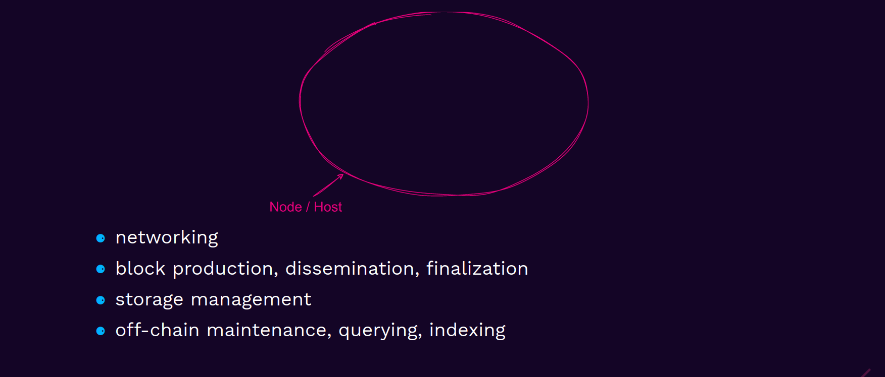
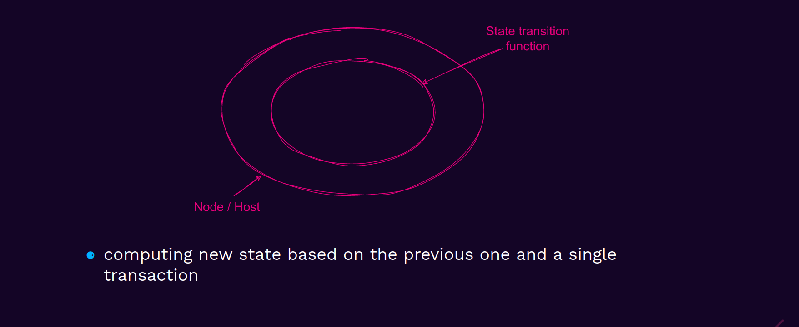
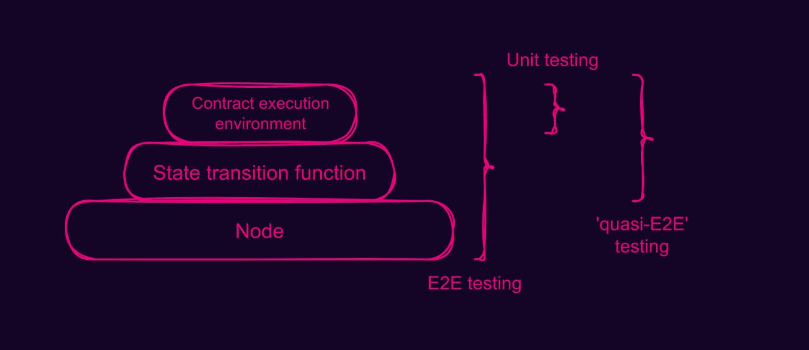

# Squink-Splash playground

This directory contains three very simple player strategies for the Squink-Splash game.
You can use them to build your own awesome player contract!

## Code organization

The base strategy contract can be found in the [my-player](./my-player) directory.
There, you will also find some example tests.

For a full game simulation against other players, you can also include two other simple players:
 - [random-player](./rand-player) - a player that makes random moves
 - [corner-player](./corner-player) - a player that starts painting in the right bottom corner of the board and then moves towards the left top corner

## Running tests

```bash
cd my-player/

# run unit tests (optionally without the `--release` flag)
cargo test --features unit-tests --release

# run quasi-e2e tests (optionally without the `--release` flag)
cargo test --features drink-tests --release
```

For the sake of hands-on workshops, we omit the E2E paradigm, as it requires the most complex setup and does not provide much value over drink tests.

---

## Testing strategies: brief recap

There are three primary paradigms for testing ink! smart contracts:
 - [Unit testing](./my-player/src/unit_tests.rs)
 - [End-to-End testing](./my-player/src/e2e_tests.rs)
 - ['quasi-End-to-End' testing](./my-player/src/drink_tests.rs)

The best way to understand the differences between them is to look at the technology stack, that they are touching.

### Smart contract execution onion

When we submit a contract call (or instantiation) to a blockchain, our transaction goes through a few layers.
Firstly, it will be delivered to some validator's node binary.



Then, we will try to execute the transaction in order to compute new updated state.
For this, a transition function (runtime) will be spawned as an auxiliary procedure.


Since the transaction was targeting some smart contract (in opposite to a 'predefined' runtime API like a token transfer), we must spawn yet another environment specially for the contract execution.


While the situation is a bit complex, we have very clear boundaries between the layers.
This allows us to design different effective testing strategies for various segments of the stack that we would like to interact with.

